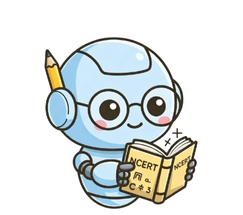

# Studybuddy AI

<p align="center">
  
</p>

An AI-powered NCERT tutoring chatbot that explains concepts in **Hinglish** (Hindi + English) and **Tanglish** (Tamil + English) — the way students actually talk.

Built with **Streamlit** + **Groq AI** (LLaMA 3.3 70B).

**Live app: [studybuddy-ai-ncert.streamlit.app](https://studybuddy-ai-ncert.streamlit.app)**

---

## Features

### Core Chat
- AI tutor with a friendly college-senior personality
- Natural Hinglish & Tanglish code-switching (not robotic translation)
- Context-aware responses tied to class, subject, and chapter
- Conversation memory within sessions

### Classes 8–12 Support
- **Classes 8, 9, 10**: Science, Social Science, Mathematics, English, Hindi, Tamil
- **Classes 11, 12**: Three streams — Bio-Maths, Computer Science, Commerce
  - Bio-Maths: Physics, Chemistry, Biology, Mathematics, English
  - Computer Science: Physics, Chemistry, Mathematics, CS, English
  - Commerce: Business Studies, Economics, Accountancy, Mathematics, English
- Full NCERT chapter lists for every class/subject combination
- Tamil follows TN Samacheer Kalvi syllabus

### Study Tools
- **Notes** — AI-generated revision cheat sheets per chapter
- **Quiz** — 5 MCQs with scoring, explanations, and retry
- **Flashcards** — 8 flip cards with shuffle and navigation
- All tools regenerate when you switch language or chapter

### Multi-Session Chat History
- Create unlimited chat sessions with "New Chat"
- Auto-titled from first message
- Switch between past sessions instantly
- Persistent JSON storage across page reloads
- Clear individual or all history

### Voice Input
- Floating mic button using Web Speech API (Chrome)
- Real-time speech-to-text in en-IN locale
- Visual recording indicator

### File Upload & Vision
- **Images** (PNG, JPG) — analyzed by LLaMA 4 Scout vision model
- **PDFs** — text extracted and used as context for Q&A
- Upload diagrams, textbook pages, or handwritten problems

### UI / UX
- Animated mascot in header (CSS keyframe study-bob animation)
- Purple gradient theme with light/dark mode support
- Chapter badge showing Class > Subject > Chapter
- Starter questions per chapter for quick start
- Responsive centered layout

---

## Tech Stack

| Component | Technology |
|-----------|-----------|
| Frontend | Streamlit 1.40+ |
| AI Model | Groq API — llama-3.3-70b-versatile |
| Vision Model | meta-llama/llama-4-scout-17b-16e-instruct |
| PDF Parsing | pypdf 4.0+ (optional) |
| Voice | Web Speech API (browser-native) |
| Storage | JSON file (chat_sessions.json) |
| Language | Python 3.x |

---

## Project Structure

```
studybuddy-ai/
  app.py              Main Streamlit application (~1100 lines)
  config.py            Classes, subjects, chapters, starter questions
  prompts.py           Hinglish & Tanglish system prompts
  mascot.png           Animated header mascot
  requirements.txt     Python dependencies
  .env                 GROQ_API_KEY (not committed)
  chat_sessions.json   Persistent chat history (auto-generated)
```

---

## Setup

1. **Clone the repo**
   ```bash
   git clone https://github.com/nareshh3105/srm-hackathon.git
   cd srm-hackathon
   ```

2. **Install dependencies**
   ```bash
   pip install -r requirements.txt
   ```

3. **Add your Groq API key**

   Create a `.env` file in the project root:
   ```
   GROQ_API_KEY=your_groq_api_key_here
   ```
   Get a free key at [console.groq.com](https://console.groq.com)

4. **Run the app**
   ```bash
   streamlit run app.py
   ```

5. Open `http://localhost:8501` in your browser.

---

## How It Works

### Language System

The AI doesn't translate — it thinks natively in the target language:

**Hinglish example:**
> Dekh bhai, photosynthesis basically plants ka apna khana khud banana hai! Sunlight uska gas stove hai, CO2 aur paani raw ingredients hain.

**Tanglish example:**
> Seri paaru, photosynthesis-nu sonna plants thaniyaa saapadu panni'kkum process! Sunlight adoda gas stove, CO2-um water-um raw ingredients.

Technical terms (photosynthesis, voltage, democracy, polynomial) always stay in English — never translated.

### Curriculum Flow

```
Class selector (8-12)
  +-- Group selector (only for 11/12: Bio-Maths / CS / Commerce)
       +-- Subject selector (dynamic per class/group)
            +-- Chapter selector (full NCERT chapter list)
                 +-- Chat / Notes / Quiz / Flashcards
```

### Session Management
- Switching class, group, or subject auto-saves the current chat and starts a new session
- Switching language regenerates the last AI response and all tool content
- Chat history persists in `chat_sessions.json` across browser refreshes

### Architecture

```
User Input (text / voice / image / PDF)
        |
        v
    app.py (Streamlit UI + session state)
        |
        v
    prompts.py (builds system prompt with class/subject/chapter/language)
        |
        v
    config.py (resolves chapters, starter questions, subject lists)
        |
        v
    Groq API (LLaMA 3.3 70B / LLaMA 4 Scout for vision)
        |
        v
    Response rendered in chat / notes / quiz / flashcards
```

---

## Key Functions

| Function | File | Purpose |
|----------|------|---------|
| `get_response()` | app.py | Main chat API call with context |
| `get_vision_response()` | app.py | Image analysis via vision model |
| `generate_quiz()` | app.py | Create 5 MCQs as JSON |
| `generate_flashcards()` | app.py | Create 8 flashcards as JSON |
| `generate_notes()` | app.py | Create chapter revision notes |
| `get_system_prompt()` | prompts.py | Build language-aware system prompt |
| `get_subjects()` | config.py | Get subject list for class/group |
| `get_chapters()` | config.py | Get chapter list for class/subject |
| `get_starter_questions()` | config.py | Get 3 starter questions per chapter |
| `sync_current_session()` | app.py | Save current session to disk |
| `load_sessions_data()` | app.py | Load all sessions with migration |

---

## Development History

| Stage | What was done |
|-------|--------------|
| v1 — Base | Streamlit + Groq chatbot with Class 10 Science only |
| v2 — Memory | Persistent chat history using chat_history.json |
| v3 — Subjects | Expanded to 6 subjects: Science, Social Science, Maths, English, Hindi, Tamil |
| v4 — CSS | Light/dark mode with proper contrast, gradient theme |
| v5 — Sessions | Multi-session chat with New Chat button, history panel, clear history |
| v6 — Tools | Added Notes, Quiz, and Flashcards generation tools |
| v7 — Classes | Expanded from Class 10 to Classes 8-12 with stream/group support for 11/12 |
| v8 — Rebrand | Renamed to Studybuddy AI, added animated mascot, removed all emojis |
| v9 — Prompts | Enhanced Hinglish & Tanglish prompts for authentic, natural language |

---

## Team - AI Builders

- Naresh Kumar G S (II, EEE, SSN College Of Engineering)
- Sujitha C B (II, CSE, SSN College Of Engineering)
\
Built for SRM Hackathon
---

## License

This project is for educational purposes.
